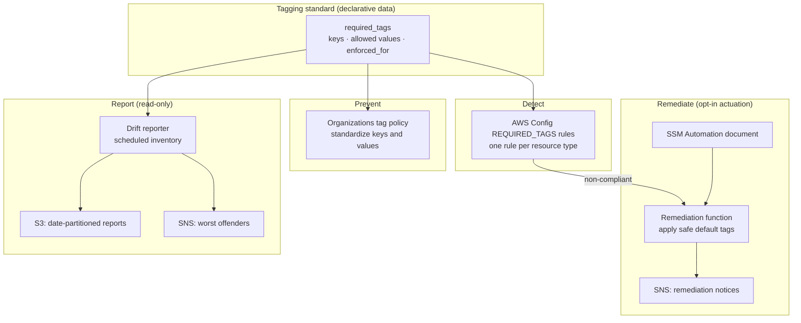

# aws-tagging-governance

Tag governance for AWS: standardize the tags every resource must carry, detect
resources that fall out of compliance, remediate them automatically, and report
on drift. The controls layer together — a preventive organization-wide tag
policy on top, detective AWS Config rules underneath, and automated remediation
and reporting closing the loop.



## Capabilities

| Layer | Control | Purpose |
|-------|---------|---------|
| Prevent | Organizations tag policy | Standardize required tag keys, allowed values, and the resource types a non-compliant value is blocked on |
| Detect | AWS Config required-tags rules | Continuously evaluate resources against the tagging standard |
| Remediate | Tag remediation automation | Apply safe default tags to non-compliant resources and notify owners |
| Report | Drift reporter | Summarize untagged and mis-tagged resources and deliver the report |

All four layers ship from a single declarative tagging standard, so adding a new
required tag is a one-line change that flows through prevention, detection,
remediation, and reporting alike.

## Repository layout

| Path | Description |
|------|-------------|
| `versions.tf` | Terraform and provider version constraints |
| `providers.tf` | AWS provider and organization-wide default tags |
| `variables.tf` | Input variables, including the declarative tagging standard |
| `tag-policies.tf` | Organizations tag policy document and attachments |
| `config-rules.tf` | AWS Config required-tags rules with per-resource scoping and an optional recorder |
| `remediation.tf` | Remediation function, notification topic, SSM Automation document, and Config remediation wiring |
| `reporting.tf` | Drift reporter function, report bucket, notification topic, and schedule |
| `outputs.tf` | Policy ID/ARN, rendered document, Config rule names/ARNs, function and topic references |
| `lambda/tag-remediator/` | Function that applies default tags to non-compliant resources |
| `lambda/tag-drift-reporter/` | Read-only function that reports resources missing required tags |
| `ssm/tag-remediation.yaml` | SSM Automation document that invokes the remediation function |
| `tests/` | Unit tests for the remediation and drift-reporter functions |
| `.github/workflows/ci.yml` | Terraform validate, TFLint, and pytest pipeline |
| `Makefile` | Deploy, scan, and lint entry points |
| `docs/` | Tagging standard reference and operator runbook |

## Documentation

- [Tagging standard](docs/tagging-standard.md) — the required tag keys, allowed
  values, per-resource enforcement matrix, and how to extend the standard.
- [Operator runbook](docs/runbook.md) — the review-first rollout, remediation
  procedures, drift-report triage, and the documented opt-out.

## The tagging standard

The required tags are declared as data in `variables.tf`. Each entry maps a tag
key to its allowed values and the resource types the value is enforced on:

```hcl
required_tags = {
  Environment = {
    allowed_values = ["production", "staging", "development", "sandbox"]
    enforced_for   = ["ec2:instance", "ec2:volume", "s3:bucket", "rds:db"]
  }
  Owner      = {}                       # required key, free-form value
  CostCenter = { enforced_for = ["ec2:instance", "rds:db"] }
}
```

- An empty `allowed_values` list means the key is required but its value is free
  form.
- An empty `enforced_for` list means non-compliant values are reported (by the
  detective layer) but not blocked at tag-modification time.

The configuration turns this into the AWS tag-policy schema automatically. See
the [tagging standard reference](docs/tagging-standard.md) for the full matrix.

## Enforcement flow

1. **Prevent.** The Organizations tag policy standardizes keys and values across
   the accounts it is attached to. With no attachment targets it is created but
   inert, so the rendered document can be reviewed before it takes effect.
2. **Detect.** One AWS Config `REQUIRED_TAGS` rule per resource type
   continuously evaluates existing resources against their required-key set.
3. **Remediate.** When a resource is flagged non-compliant, the remediation
   function fills in the *missing* required keys that have a safe default, never
   overwriting an existing value, and publishes a summary. Actuation is opt-in.
4. **Report.** On a schedule, the drift reporter inventories every in-scope
   resource, writes a date-partitioned JSON report to an encrypted bucket, and
   publishes a worst-offenders-first summary.

## Quick start

Organizations tag policies are managed from the management account or a
delegated administrator for the Organizations policy service. Point the provider
at that account, then:

```bash
make init
make plan

# Review the rendered policy before attaching it anywhere:
terraform output -raw tag_policy_document | jq

# Attach to an organization root, OU, or account by setting policy_target_ids,
# then apply. Use real IDs in your own environment; the examples are placeholders.
terraform apply -var 'policy_target_ids=["r-abcd"]'
```

Example values in this repository use placeholders only — organization root
`r-abcd`, OU `ou-abcd-11111111`, and account ID `123456789012`. Replace them
with your own before applying.

## Detective layer — AWS Config

`config-rules.tf` creates one AWS Config `REQUIRED_TAGS` rule per resource type,
so each type is evaluated against its own required-key set. The mapping lives in
the `config_rule_resource_scopes` variable, and the allowed values for each key
are sourced from the same `required_tags` definition the tag policy uses. Each
rule is scoped to a single resource type via `compliance_resource_types` and
packs up to six keys into the managed rule's input schema. The rules assume a
configuration recorder is already active (the common case when Config is enabled
centrally); set `create_config_recorder = true` to provision a recorder,
delivery channel, and hardened delivery bucket for a standalone account.

## Remediation layer

`remediation.tf` provisions an automated workflow that fills in the
organization's default tag values on non-compliant resources and publishes a
summary. The remediation is deliberately conservative: it sets only the
*missing* required keys that have a safe default in `default_tag_values`, never
overwrites an existing value, skips any resource carrying an opt-out tag key
(`remediation_exclusion_tag_keys`), and supports a `remediation_dry_run`
report-only mode. Actuation is opt-in — the function, topic, and SSM document
are created by default, but `enable_event_driven_remediation` and
`enable_config_remediation` stay off until you turn them on. See the
[runbook](docs/runbook.md) for the rollout procedure.

## Reporting layer

`reporting.tf` provisions a scheduled, read-only inventory of tag drift. On each
run the function enumerates resources through the Resource Groups Tagging API,
compares each against the required-key set for its type, writes a
date-partitioned JSON report to an encrypted S3 bucket, and publishes a text
summary to a dedicated SNS topic, worst offenders first. Scoping mirrors the
detective layer via `drift_resource_type_scopes`. The scan writes nothing back
to any resource, honours the same opt-out tag keys as remediation, is
self-contained (its own key, bucket, and topic), and runs on the schedule set by
`drift_report_schedule_expression` (weekly by default).

## Configuration reference

| Variable | Default | Purpose |
|----------|---------|---------|
| `required_tags` | 5 standard keys | The declarative tagging standard |
| `policy_target_ids` | `[]` | Org roots/OUs/accounts to attach the policy to (empty = inert) |
| `enable_config_rules` | `true` | Create the detective Config rules |
| `config_rule_resource_scopes` | 5 resource types | Required keys per Config resource type |
| `create_config_recorder` | `false` | Provision a recorder for standalone accounts |
| `enable_remediation` | `true` | Provision the remediation function, topic, and SSM document |
| `default_tag_values` | 4 safe defaults | Values applied to missing required keys |
| `enable_event_driven_remediation` | `false` | Trigger remediation on Config compliance-change events |
| `enable_config_remediation` | `false` | Wire each Config rule to the SSM remediation document |
| `remediation_dry_run` | `false` | Report-only mode for remediation |
| `enable_drift_reporting` | `true` | Provision the scheduled drift reporter |
| `drift_resource_type_scopes` | 5 resource types | Required keys per scanned resource type |
| `drift_report_schedule_expression` | weekly | How often the drift scan runs |

## Validation

The CI pipeline runs `terraform fmt -check`, `terraform validate`, TFLint, and
the pytest suite. Reproduce it locally with `make validate` (see the
[runbook](docs/runbook.md) for details).

## Design principles

- **Standard as data.** The tagging standard is a single declarative variable,
  not hand-written policy JSON, so it is easy to review and extend.
- **Review before enforce.** With no attachment targets the policy is created
  but inert, letting you inspect the rendered document before it takes effect.
- **Layered controls.** Prevention, detection, remediation, and reporting are
  separate, composable layers rather than a single mechanism.
- **Report, never mutate.** The drift reporter only reads and summarizes;
  changing a resource's tags is the remediation layer's job alone.

## License

Released under the MIT License. See [LICENSE](LICENSE).
